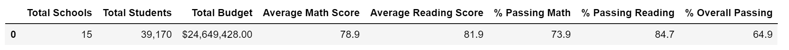
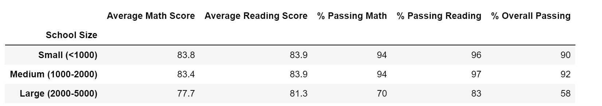
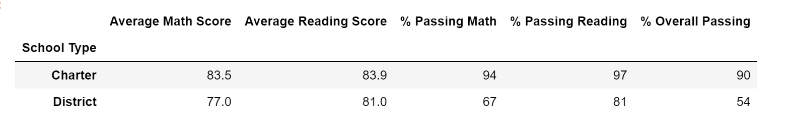
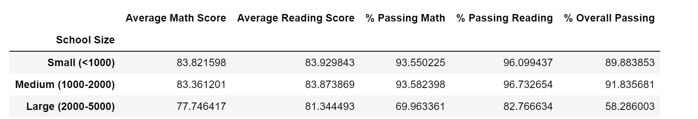
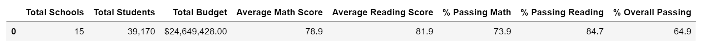

# School_District_Analysis
PyCity Schools Analysis - Challenge

# Overview of the school district analysis

The purpose of this updated analysis is to prepare aggregate reading and math test scores of multiple schools and districts and 
identify performance trends and patterns. Also included is addtional school information on the schools such as  spend per student, 
school type and budget. The data summaries and corresponding presentationswill be provided to the school board as input for
discussions regarding strategic decisions at the school and district levels.

# Results

## How is the district summary affected?

- The school with the largest budget is a district school
- The largest budget has a lower percent of passing students than others.
- Charter schools which are smaller in size and have a smaller budget have higher 
percentages for both reading and math.

- Per student spending doesn't guarantee better overall passing scores however higher 
ranges ($630-644 and $645-675) equate to high reading scores.
- The lower spending per student generates the highest reading, math scores which equal higher overall passing percentage.
- Charter schools have the best scores in reading and math.

##  How is the school summary affected?

- Small and medium schools have better percentages of students passing math and
reading which increase the overall passing percentages to 89.89% for small schools 
and 91.84% for medium schools.
- Large district schools have a lower overall passing percentage and per student 
spend at 58.29%. 
- Hernandez High School is a large school with substantial budget ($3,022,020) but 
has a 53.73% passing rate with 80.27% passing reading but only 66.76% passing math.

## How does replacing the ninth graders' math and reading scores affect Thomas High School's performance relative to the other schools?

- Math and reading scores by grade
Increased scores for ninth grade only, other grades unchanged
- Scores by school spending
Spending stayed the same
- Scores by school size
Still rated as medium size
- Scores by school type
Increased overall percentage passing

## Summary

Summarize four major changes in the updated district analysis after reading and math scores for the ninth grade 
at Thomas High School have been replaced with NaNs.

- Thomas High School still not included in either top or bottom schools.
- The overall percentages dropped.

- Overall math score / percentage passing improved slightly  .
- Overall readin score / percentage passing improved slightly
